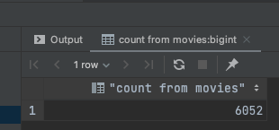
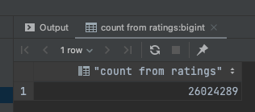

# Movies-ETL
For DataScience bootcamp

## Summary
The included Notebooks analyze the data from Kaggle, wikipedia and ratings.

The work was done in stagges

## To review
1. [ETL_function_test](ETL_function_test.ipynb): Test the extraction process.
2. [ETL_clean_wiki_movies](ETL_clean_wiki_movies.ipynb): Advance the process by cleaning the data coming from wikipedia
3. [ETL_clean_kaggle_data](ETL_clean_kaggle_data.ipynb): Clean and merge the data provided by Kaggle, see what merging the ratings data looks like.
4. [ETL_create_database](ETL_create_database.ipynb): Import the finished data into proper tables and get the row counts.

## Conclusion
The result of all the processing produced a few screenshots of the row counts which are provided here:

### Movie Count

### Ratings Count

